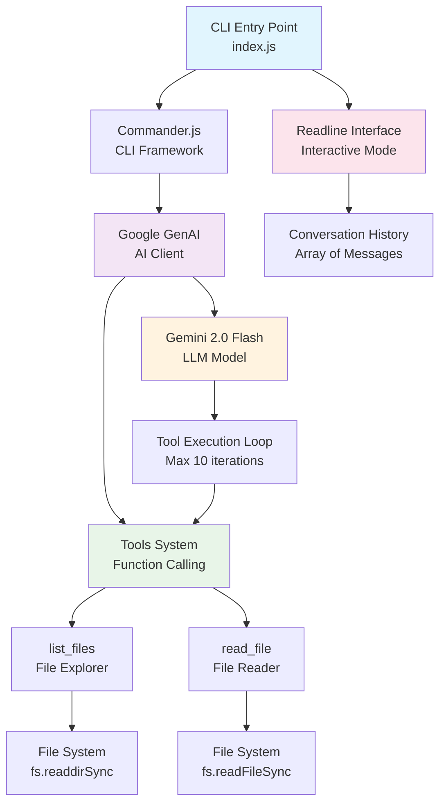

# AI Agent Architecture

## Library Descriptions

### Core Libraries

**@google/genai (^1.15.0)**
- Google's official Node.js SDK for Gemini AI models
- Handles authentication, API communication, and function calling
- Provides structured access to Gemini 2.0 Flash model capabilities

**commander (^14.0.0)**
- Popular Node.js CLI framework for building command-line interfaces
- Handles argument parsing, options, and command structure
- Provides version management and help text generation

**readline (^1.3.0)**
- Node.js built-in module for interactive command-line interfaces
- Creates REPL-like experience with prompt handling
- Manages user input/output streams and line processing

### Built-in Node.js Modules

**fs (File System)**
- Core Node.js module for file system operations
- Used for directory listing and file content reading
- Synchronous operations for tool execution

### Architecture Components

**CLI Entry Point**
- Single executable Node.js script with shebang
- Configurable via command-line options (API key, verbose mode)
- ES6 module format with modern JavaScript features

**Interactive Mode**
- Persistent conversation with history management
- Command processing loop with exit/clear capabilities
- Error handling and user feedback

**Tools System**
- Function calling framework with auto-execution
- Two primary tools: file listing and file reading
- Iterative execution loop with safety limits (max 10 iterations)

**AI Integration**
- Google Gemini 2.0 Flash model integration
- Structured conversation history management
- Tool result integration back into conversation context